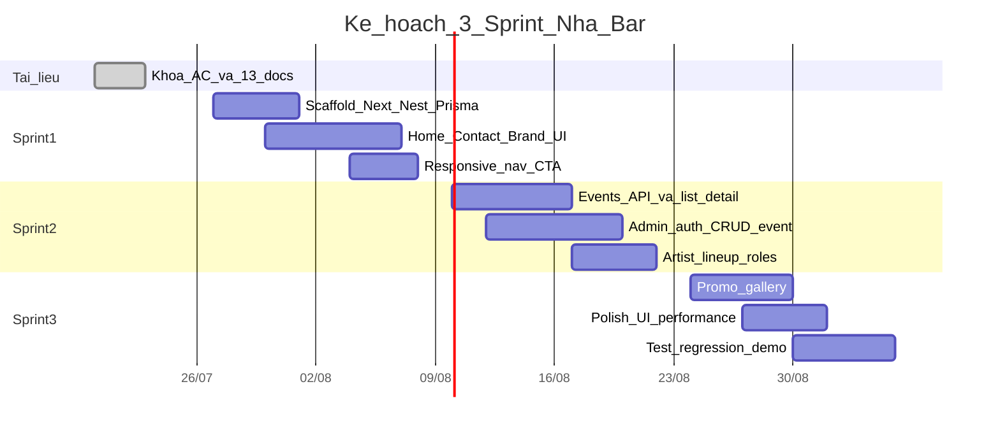

# (2) Project Plan — Website NHÀ Bar

| Trường | Giá trị |
| --- | --- |
| Dự án | Website NHÀ Bar |
| Phiên bản | 1.0 |
| Ngày | 2026-07-20 |
| Phương pháp | Scrum |

## 1. Mục đích

Lập kế hoạch thực hiện từ tài liệu → thiết kế → triển khai → kiểm thử theo 3 sprint, gắn milestone với acceptance criteria.

## 2. Mục tiêu kế hoạch

1. Hoàn tất bộ tài liệu và khóa AC (phase hiện tại).
2. Xây MVP public + admin theo Must-have trong Product Backlog.
3. Có bằng chứng test cho AC-001 … AC-010 trước khi bàn giao mẫu.

## 3. Giả định nhóm

| Vai trò | Số người | Trách nhiệm chính |
| --- | --- | --- |
| Product Owner | 1 | Ưu tiên backlog, chấp nhận sprint |
| Scrum Master | 1 (kiêm) | Ritual, rủi ro quy trình |
| Developer FE | 1–2 | Next.js, UI brand |
| Developer BE | 1 | NestJS, Prisma, auth |
| QA | 1 (kiêm Dev) | Test plan/case, regression |

*Thành viên thật: [Điền sau].*

## 4. Work Breakdown Structure (WBS)

```text
NHÀ Bar Website
├── 1. Khởi tạo & tài liệu
│   ├── 1.1 Proposal, Plan, Backlog, User Story
│   ├── 1.2 Architecture, Database, UI
│   └── 1.3 Test Plan/Case, Sprint Backlog, Code Standard, Meeting, Reflection
├── 2. Nền tảng kỹ thuật
│   ├── 2.1 Repo monorepo / apps web + api
│   ├── 2.2 PostgreSQL + Prisma schema
│   └── 2.3 CI lint + env mẫu
├── 3. Public site
│   ├── 3.1 Home + brand tokens
│   ├── 3.2 Contact / map / giờ / Facebook
│   ├── 3.3 Events list + detail + lineup
│   ├── 3.4 Promotions + gallery
│   └── 3.5 Responsive & a11y cơ bản
├── 4. Admin
│   ├── 4.1 Auth đăng nhập
│   ├── 4.2 CRUD Event
│   ├── 4.3 Gắn Artist + role
│   └── 4.4 CRUD Promo + Media
└── 5. Kiểm thử & bàn giao
    ├── 5.1 Chạy test case theo AC
    ├── 5.2 Sửa defect P0/P1
    └── 5.3 Demo + cập nhật tài liệu
```

## 5. Lịch sprint (Gantt)

Giả định bắt đầu triển khai code sau khi khóa tài liệu:



## 6. Milestone

| Milestone | Điều kiện hoàn thành | AC liên quan |
| --- | --- | --- |
| M0 — Tài liệu khóa | 13 docs + `_traceability.md` | Tất cả (định nghĩa) |
| M1 — Public skeleton | Home + Contact live trên staging | AC-001, AC-007, AC-008, AC-009 |
| M2 — Events MVP | List/detail + admin CRUD + lineup | AC-002 … AC-005 |
| M3 — MVP hoàn chỉnh | Promo + gallery + test pass | AC-006, AC-010 + regression |

## 7. Định nghĩa Done (DoD) cấp dự án

- Code merge được sau lint; không commit secret.
- User Story trong sprint có AC rõ; Test Case tương ứng chạy và ghi kết quả.
- UI tuân design tokens trong tài liệu UI.
- Tài liệu liên quan đã sync nếu đổi hành vi.

## 8. Rủi ro kế hoạch

| Rủi ro | Xác suất | Tác động | Mitigation | Owner |
| --- | --- | --- | --- | --- |
| Trễ backend auth | TB | Chặn Sprint 2 | Mock auth sớm; JWT đơn giản trước RBAC phức tạp | BE |
| Poster ảnh nặng | TB | UI chậm | Compress; lazy load | FE |
| Scope creep đặt bàn | Cao | Trễ M3 | Giữ Contact form / link Messenger thay reservation engine | PO |
| Thành viên kiêm nhiều role | Cao | Chất lượng test | Dành 1 ngày cuối sprint chỉ regression | SM |

## 9. Phụ thuộc

- Logo / poster mẫu từ brand NHÀ Bar.
- Nội dung giờ mở cửa và địa chỉ đã xác nhận.
- Tài khoản Facebook page để lấy link chính thức.
- Môi trường PostgreSQL (local Docker hoặc cloud free tier).

## 10. Kế hoạch truyền thông nội bộ

| Ritual | Tần suất | Đầu ra |
| --- | --- | --- |
| Daily standup | Mỗi ngày làm việc | Blocker |
| Sprint Planning | Đầu sprint | Sprint Backlog |
| Review + Retro | Cuối sprint | Demo theo AC; action cải tiến |
| Cập nhật docs | Khi đổi AC/scope | `_traceability.md` + file liên quan |

## 11. Tham chiếu

- Proposal: [`01_Project_Proposal.md`](01_Project_Proposal.md)
- Backlog: [`03_ProductBacklog.md`](03_ProductBacklog.md)
- Sprint Backlog: [`10_Project_SprintBacklog.md`](10_Project_SprintBacklog.md)
- Trace: [`_traceability.md`](_traceability.md)
