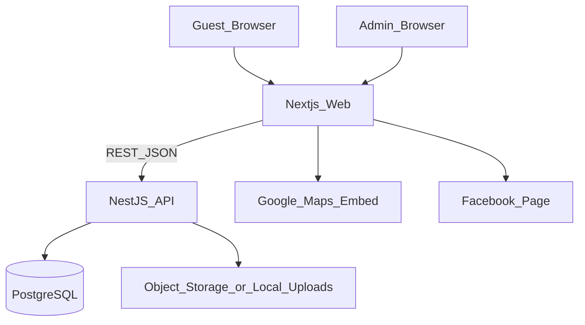
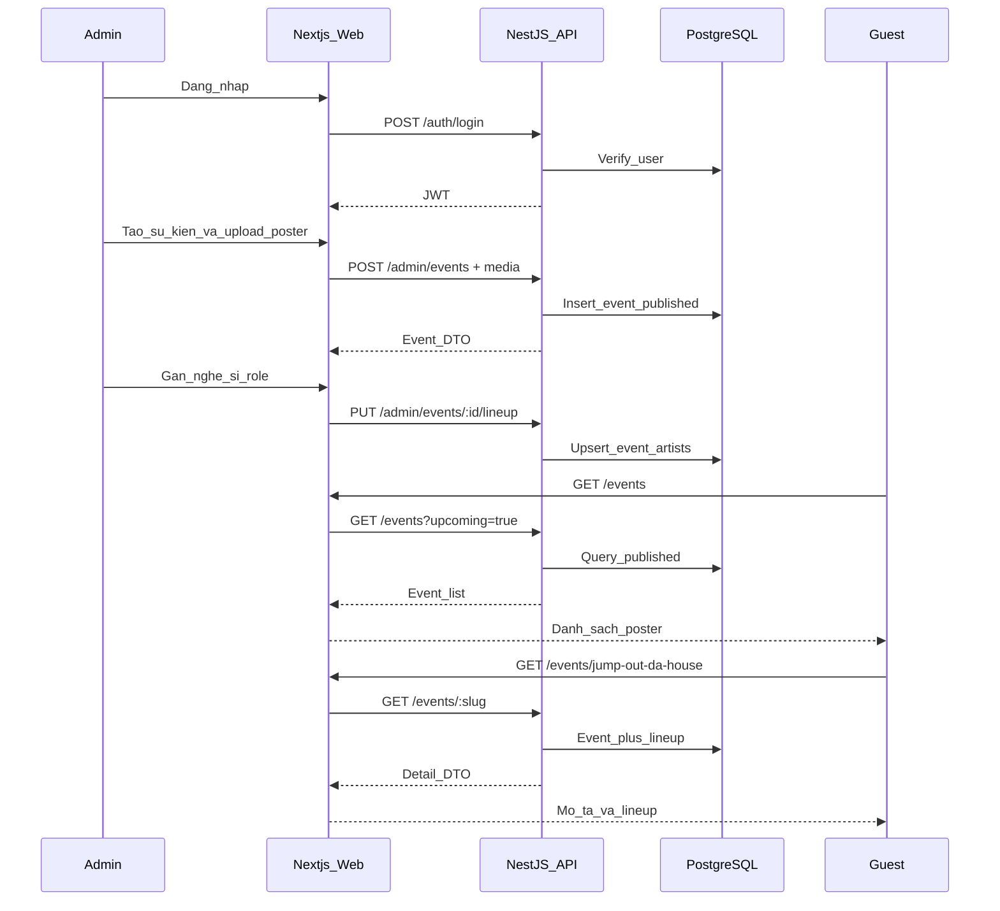
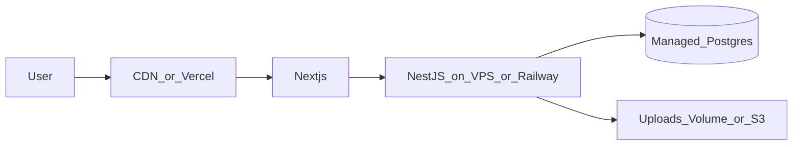

# (5) Project Architecture Design — Website NHÀ Bar

| Trường | Giá trị |
| --- | --- |
| Hệ thống | NHÀ Bar Official Website |
| Stack | Next.js (App Router) + NestJS + Prisma + PostgreSQL |
| Phiên bản | 1.0 |
| Ngày | 2026-07-20 |

## 1. Mục đích

Mô tả kiến trúc logic và luồng chính để triển khai public site + admin quản lý sự kiện, phục vụ AC-001 … AC-010.

## 2. Mục tiêu kiến trúc

- Tách rõ **Public FE**, **Admin FE**, **API**, **DB**, **Media storage**.
- Admin thay đổi sự kiện → public đọc được qua API ổn định.
- Bảo vệ route admin; public chỉ đọc dữ liệu `published`.
- Đủ đơn giản cho MVP học thuật / bàn giao mẫu, mở rộng CDN/media sau.

## 3. Context diagram



**Quyết định:** Next.js render UI (SSR/SSG nơi phù hợp); NestJS là nguồn sự thật nghiệp vụ (events, artists, auth). Postgres lưu dữ liệu có cấu trúc; file ảnh lưu local uploads ở MVP, có thể chuyển S3-compatible sau.

## 4. Logical containers

| Container | Công nghệ | Trách nhiệm |
| --- | --- | --- |
| Web | Next.js App Router | Pages public + admin UI; gọi API; SEO cơ bản |
| API | NestJS | Auth, CRUD, query public, validation |
| DB | PostgreSQL + Prisma | Schema, migration, quan hệ lineup |
| Media | Local `/uploads` (MVP) | Poster & gallery |
| External | Maps, Facebook | Embed / deep link |

## 5. Module NestJS (gợi ý)

```text
apps/api
  auth/          login, JWT guard
  users/
  events/        public list/detail + admin CRUD
  artists/
  event-artists/ lineup + role + sortOrder
  promotions/
  media/
  health/
```

```text
apps/web
  app/(public)/  home, events, promos, contact
  app/(admin)/   login, dashboard, events, artists, promos
  components/    ui theo design tokens
  lib/api.ts     client gọi Nest
```

## 6. Luồng: Admin tạo sự kiện → khách xem



## 7. Auth & bảo mật (MVP)

| Hạng mục | Quyết định |
| --- | --- |
| Cơ chế | JWT Bearer sau login; cookie httpOnly nếu team chọn session cookie |
| Bảo vệ | Guard trên `/admin/*` API |
| Mật khẩu | Hash bcrypt |
| Public API | Chỉ trả `status=published` và không `hidden` |
| Secrets | `.env` — không commit (xem Code Standard) |
| CORS | Chỉ origin của web app |

## 8. API bề mặt (tóm tắt)

### Public

| Method | Path | Mô tả | AC |
| --- | --- | --- | --- |
| GET | `/events?upcoming=1` | List sắp tới | AC-002 |
| GET | `/events/:slug` | Detail + lineup + media | AC-003, AC-010 |
| GET | `/promotions/active` | Promo đang hiệu lực | AC-006 |
| GET | `/health` | Healthcheck | — |

### Admin (JWT)

| Method | Path | Mô tả | AC |
| --- | --- | --- | --- |
| POST | `/auth/login` | Đăng nhập | AC-004 |
| POST | `/admin/events` | Tạo | AC-004 |
| PATCH | `/admin/events/:id` | Sửa / ẩn | AC-004 |
| PUT | `/admin/events/:id/lineup` | Gắn artists + roles | AC-005 |
| POST | `/admin/artists` | Tạo nghệ sĩ | AC-005 |
| POST | `/admin/promotions` | CRUD promo | AC-006 |
| POST | `/admin/events/:id/media` | Upload ảnh | AC-010 |

## 9. Chiến lược render FE

| Trang | Chiến lược | Lý do |
| --- | --- | --- |
| Home | SSR hoặc ISR ngắn | Featured event đổi thường xuyên |
| Events list/detail | SSR | Dữ liệu động theo publish |
| Contact | SSG | Ít đổi |
| Admin | CSR + auth client | Không SEO |

## 10. Xử lý lỗi & quan sát

- API trả shape thống nhất: `{ "error": { "code": "...", "message": "..." } }`.
- Log request id đơn giản trên Nest.
- Không nuốt lỗi 500 thành 200.

## 11. Triển khai mục tiêu (sau MVP code)



## 12. Giới hạn kiến trúc MVP

- Chưa multi-tenant / nhiều chi nhánh.
- Chưa queue xử lý ảnh nền.
- Chưa RBAC nhiều role (chỉ Admin).
- Chưa realtime websocket.

## 13. Tham chiếu

- Database: [`06_Project_DatabaseDesign.md`](06_Project_DatabaseDesign.md)
- UI: [`07_Project_UserInterface.md`](07_Project_UserInterface.md)
- Code Standard: [`11_Project_Code_Standard.md`](11_Project_Code_Standard.md)
