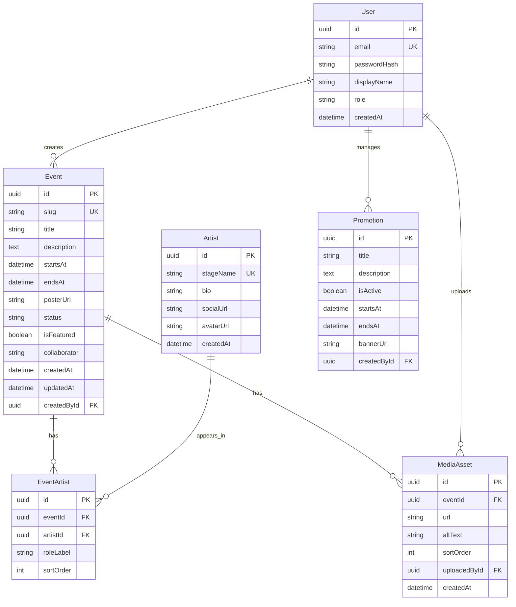

# (6) Project Database Design — Website NHÀ Bar

| Trường | Giá trị |
| --- | --- |
| DBMS | PostgreSQL |
| ORM | Prisma |
| Phiên bản | 1.0 |
| Ngày | 2026-07-20 |

## 1. Mục đích

Thiết kế schema hỗ trợ sự kiện, lineup nghệ sĩ, promo, media và tài khoản admin — đáp ứng AC-002 … AC-006, AC-010.

## 2. Nguyên tắc

- Public chỉ đọc bản ghi đủ điều kiện publish.
- Lineup là quan hệ N–N `Event` ↔ `Artist` với thuộc tính `roleLabel`, `sortOrder`.
- Soft-hide sự kiện bằng `visibility` / `status` thay vì xóa cứng ngay.
- Thời gian lưu UTC; hiển thị theo múi giờ Việt Nam (UTC+7) ở tầng ứng dụng.

## 3. ER diagram



## 4. Chi tiết bảng

### 4.1. `User`

| Cột | Kiểu | Ràng buộc | Ghi chú |
| --- | --- | --- | --- |
| id | UUID | PK | |
| email | VARCHAR(255) | UNIQUE, NOT NULL | Login |
| passwordHash | VARCHAR(255) | NOT NULL | bcrypt |
| displayName | VARCHAR(120) | NOT NULL | |
| role | VARCHAR(30) | NOT NULL DEFAULT `ADMIN` | MVP: ADMIN |
| createdAt | TIMESTAMPTZ | NOT NULL | |

### 4.2. `Event`

| Cột | Kiểu | Ràng buộc | Ghi chú |
| --- | --- | --- | --- |
| id | UUID | PK | |
| slug | VARCHAR(180) | UNIQUE, NOT NULL | SEO path |
| title | VARCHAR(200) | NOT NULL | VD: JUMP OUT DA HOUSE // RAPSHOW |
| description | TEXT | | |
| startsAt | TIMESTAMPTZ | NOT NULL | |
| endsAt | TIMESTAMPTZ | NULL | |
| posterUrl | TEXT | NULL | |
| status | VARCHAR(20) | NOT NULL | `draft` \| `published` \| `hidden` |
| isFeatured | BOOLEAN | DEFAULT false | Home AC-001 |
| collaborator | VARCHAR(200) | NULL | VD: By Midside Hustlers |
| createdById | UUID | FK User | |
| createdAt / updatedAt | TIMESTAMPTZ | | |

**Quy tắc public:** `status = 'published'` mới hiện list/detail.

**Trạng thái hiển thị “sắp diễn ra / đã qua”:** tính từ `startsAt` so với `now()` (không cần cột riêng).

### 4.3. `Artist`

| Cột | Kiểu | Ghi chú |
| --- | --- | --- |
| id | UUID PK | |
| stageName | UNIQUE | PINTEERROR, RHIN, … |
| bio | TEXT | optional |
| socialUrl | TEXT | optional |
| avatarUrl | TEXT | optional |

### 4.4. `EventArtist`

| Cột | Kiểu | Ghi chú |
| --- | --- | --- |
| id | UUID PK | |
| eventId | FK Event | ON DELETE CASCADE |
| artistId | FK Artist | |
| roleLabel | VARCHAR(40) | DJ, Rapper, Guest, Host… |
| sortOrder | INT | mặc định 0 |

**Unique:** `(eventId, artistId)` — một nghệ sĩ một dòng role trên một event (đổi role bằng update).

### 4.5. `Promotion`

| Cột | Kiểu | Ghi chú |
| --- | --- | --- |
| id | UUID PK | |
| title | VARCHAR(200) | Buy 2 Get 1 |
| description | TEXT | |
| isActive | BOOLEAN | |
| startsAt / endsAt | TIMESTAMPTZ | khung hiệu lực |
| bannerUrl | TEXT | optional |
| createdById | FK User | |

**Public active:** `isActive = true` AND `now()` trong `[startsAt, endsAt]` (endsAt null = không hạn cuối).

### 4.6. `MediaAsset`

| Cột | Kiểu | Ghi chú |
| --- | --- | --- |
| id | UUID PK | |
| eventId | FK Event | gallery theo sự kiện |
| url | TEXT | |
| altText | VARCHAR(200) | a11y |
| sortOrder | INT | |
| uploadedById | FK User | |

## 5. Index đề xuất

| Index | Lý do |
| --- | --- |
| `Event(status, startsAt)` | List upcoming |
| `Event(slug)` | Unique lookup |
| `Event(isFeatured)` WHERE published | Home featured |
| `Promotion(isActive, startsAt, endsAt)` | Active promos |
| `EventArtist(eventId, sortOrder)` | Lineup order |

## 6. Prisma sketch (tham chiếu)

```prisma
enum EventStatus {
  draft
  published
  hidden
}

model User {
  id           String   @id @default(uuid())
  email        String   @unique
  passwordHash String
  displayName  String
  role         String   @default("ADMIN")
  createdAt    DateTime @default(now())
  events       Event[]
  promotions   Promotion[]
  media        MediaAsset[]
}

model Event {
  id           String      @id @default(uuid())
  slug         String      @unique
  title        String
  description  String?
  startsAt     DateTime
  endsAt       DateTime?
  posterUrl    String?
  status       EventStatus @default(draft)
  isFeatured   Boolean     @default(false)
  collaborator String?
  createdById  String
  createdBy    User        @relation(fields: [createdById], references: [id])
  lineup       EventArtist[]
  media        MediaAsset[]
  createdAt    DateTime    @default(now())
  updatedAt    DateTime    @updatedAt
}

model Artist {
  id        String   @id @default(uuid())
  stageName String   @unique
  bio       String?
  socialUrl String?
  avatarUrl String?
  events    EventArtist[]
  createdAt DateTime @default(now())
}

model EventArtist {
  id        String @id @default(uuid())
  eventId   String
  artistId  String
  roleLabel String
  sortOrder Int    @default(0)
  event     Event  @relation(fields: [eventId], references: [id], onDelete: Cascade)
  artist    Artist @relation(fields: [artistId], references: [id])
  @@unique([eventId, artistId])
}

model Promotion {
  id          String   @id @default(uuid())
  title       String
  description String?
  isActive    Boolean  @default(true)
  startsAt    DateTime
  endsAt      DateTime?
  bannerUrl   String?
  createdById String
  createdBy   User     @relation(fields: [createdById], references: [id])
}

model MediaAsset {
  id           String   @id @default(uuid())
  eventId      String
  url          String
  altText      String?
  sortOrder    Int      @default(0)
  uploadedById String
  event        Event    @relation(fields: [eventId], references: [id], onDelete: Cascade)
  uploadedBy   User     @relation(fields: [uploadedById], references: [id])
  createdAt    DateTime @default(now())
}
```

## 7. Dữ liệu mẫu — JUMP OUT DA HOUSE

**Event**

| Field | Value |
| --- | --- |
| title | JUMP OUT DA HOUSE // RAPSHOW |
| slug | jump-out-da-house-rapshow |
| startsAt | 2026-07-10T19:00:00+07:00 |
| collaborator | By Midside Hustlers |
| status | published |
| isFeatured | true |

**Lineup (rút gọn)**

| stageName | roleLabel | sortOrder |
| --- | --- | --- |
| PINTEERROR | DJ | 1 |
| RHIN | DJ | 2 |
| RECKO | DJ | 3 |
| WALA | Rapper | 4 |
| LEMWAI | Rapper | 5 |
| RINGO | Rapper | 6 |
| LOCKIE | Rapper | 7 |
| KAYTEE | Guest | 8 |
| NICC | Rapper | 9 |
| ICY MENG | Rapper | 10 |
| LIL BOY | Rapper | 11 |

**Promotion mẫu**

| title | description | isActive |
| --- | --- | --- |
| World Cup 2026 | Buy 2 Get 1 / 10% Off theo poster quán | true |

## 8. Migration & seed

1. `prisma migrate dev` tạo schema.
2. Seed: 1 admin, 1 event mẫu, artists + EventArtist, 1 promo, vài MediaAsset.
3. Không xóa production bằng migrate reset.

## 9. Bảo mật dữ liệu

- Không lưu mật khẩu plain text.
- Không expose `passwordHash` trong DTO.
- Backup Postgres định kỳ khi lên staging/production.

## 10. Tham chiếu

- Architecture: [`05_Project_ArchitectureDesign.md`](05_Project_ArchitectureDesign.md)
- User Stories: [`04_Project_UserStory.md`](04_Project_UserStory.md)
