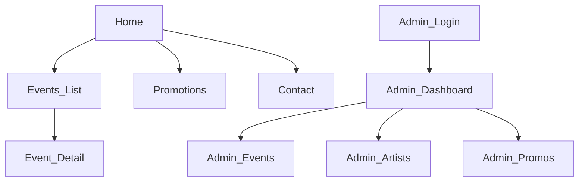

# (7) Project User Interface — Website NHÀ Bar

| Trường | Giá trị |
| --- | --- |
| Sản phẩm | NHÀ Bar Official Website |
| Phiên bản | 1.0 |
| Ngày | 2026-07-20 |
| AC liên quan | AC-001, AC-007, AC-008, AC-009, AC-010 |

## 1. Mục đích

Định nghĩa giao diện bản mẫu: mục đích từng màn hình, look & feel thương hiệu, và tiêu chí chấp nhận UI — để FE không thiết kế generic.

## 2. Định vị trải nghiệm

NHÀ Bar là **nhà + bar**: ấm, chill, nhạc hay, đồ uống tốt; đồng thời nights sự kiện mang năng lượng urban/hip-hop.

| Lớp UI | Hướng |
| --- | --- |
| Chrome hệ thống (nav, CTA, form, admin) | Tối giản, dark, accent bronze/gold theo logo |
| Nội dung sự kiện (poster) | Cho phép đỏ–đen–trắng, checkerboard, typography mạnh **bên trong khung media** |
| Hero Home | Brand-first: tên/logo là tín hiệu mạnh nhất viewport đầu |

**Brand test:** Bỏ thanh nav đi, viewport đầu vẫn phải nhận ra NHÀ Bar — không thể gắn logo quán khác rồi vẫn “đúng trang”.

## 3. Design tokens

### 3.1. Màu

| Token | Giá trị gợi ý | Dùng cho |
| --- | --- | --- |
| `--bg-base` | `#0E0B0A` | Nền trang (Espresso Ember) |
| `--bg-elevated` | `#241A17` | Surface / panel |
| `--text-primary` | `#FFF7ED` | Chữ chính |
| `--text-muted` | `#C4B5A8` | Phụ |
| `--accent-bronze` | `#C59D73` | Logo bronze / CTA / focus |
| `--accent-bronze-hover` | `#D4B08A` | Hover |
| `--accent-ember` | `#FB923C` | Điểm nhấn sự kiện (rất hạn chế) |
| `--border-subtle` | `rgba(197,157,115,0.18)` | Divider |

**Cấm làm theme chính:** purple/indigo gradient; cream `#F4F1EA` làm nền full-page; broadsheet hairline newspaper.

### 3.2. Typography

| Vai trò | Hướng font | Ghi chú |
| --- | --- | --- |
| Brand / display | Syne 600/700 | Khớp logo geometric |
| Body | Manrope 400–700 | Đọc mobile tốt; không Inter/Roboto |
| Event poster text | Theo artwork — không ép vào design system chrome |

### 3.3. Spacing & motion

- Spacing scale 4/8/16/24/40/64.
- Motion tối thiểu 2–3 chỗ có chủ đích: fade-in hero brand, hover CTA bronze, transition list events — không particle/glow tím.

### 3.4. Layout rules (khớp design discipline)

- Viewport đầu Home: brand + 1 headline ngắn + 1 câu hỗ trợ + 1 nhóm CTA + 1 visual chủ đạo. Không nhồi schedule/stats vào hero.
- Không card trong hero. Card chỉ khi cần container tương tác (form admin, item list có hành động).
- Poster sự kiện full-bleed trong khu media của trang Events/Detail; không collage lộn xộn ở Home.

## 4. Sitemap



## 5. Màn hình public

### 5.1. Home `/` — AC-001, AC-008

**Một việc:** Khẳng định brand và dẫn vào sự kiện.

| Vùng | Nội dung |
| --- | --- |
| Hero | Logo/wordmark NHÀ Bar; câu “A place called home”; CTA “Xem sự kiện” (+ optional “Liên hệ”) |
| Featured | 1 sự kiện nổi bật: tiêu đề + ngày + poster crop cẩn thận |
| Footer | Địa chỉ rút gọn + Facebook |

**Wireframe text**

```text
┌─────────────────────────────────────────┐
│  NHÀ BAR                    Events Cont.│
│─────────────────────────────────────────│
│                                         │
│         [ LOGO NHÀ / BAR ]              │
│         A place called home             │
│         Chillin’ · Music · Drinks       │
│         [ Xem sự kiện ]                 │
│                                         │
│         (visual đêm quán / poster)      │
│─────────────────────────────────────────│
│  Sắp tới: JUMP OUT DA HOUSE · 10/07     │
└─────────────────────────────────────────┘
```

### 5.2. Events `/events` — AC-002, AC-009

**Một việc:** Quét lịch đêm nhạc / sự kiện.

Mỗi hàng/item: poster thumbnail, title, date/time. Không meta thừa. Empty state nếu chưa có show.

### 5.3. Event Detail `/events/[slug]` — AC-003, AC-010

**Một việc:** Hiểu show này là gì và ai lên sóng.

- Poster lớn (edge-to-edge trong content column).
- Title, datetime, collaborator, status badge (Sắp diễn ra / Đã qua).
- Mô tả ngắn.
- Lineup: tên + role (không card dày bóng).
- Gallery: lưới ảnh đơn giản nếu có media.

### 5.4. Promotions `/promotions` — AC-006

**Một việc:** Thấy ưu đãi đang active.

- List promo title + mô tả; banner optional.
- Không hiện promo inactive.

### 5.5. Contact `/contact` — AC-007

**Một việc:** Biết đường tới quán và kênh chính thức.

| Block | Nội dung cố định |
| --- | --- |
| Địa chỉ | 35 Ngõ Thì Sĩ, Mỹ An, Đà Nẵng |
| Giờ | 11:00 AM – Late |
| Map | Embed hoặc nút mở Google Maps |
| Social | Link Facebook NHÀ Bar |
| Optional | Nút Message / form liên hệ đơn giản (Could) |

## 6. Màn hình Admin (functional UI)

Admin ưu tiên rõ ràng hơn “đẹp poster”: bảng, form, trạng thái.

| Màn hình | Thành phần chính |
| --- | --- |
| Login | Email + password; lỗi rõ |
| Dashboard | Shortcut: Events / Artists / Promos |
| Events | Table + form create/edit; status draft/published/hidden; featured toggle; upload poster |
| Lineup editor | Chọn artist + roleLabel + sortOrder |
| Artists | CRUD stageName |
| Promos | CRUD + isActive + date range |
| Media | Upload gắn event |

## 7. Responsive

| Breakpoint | Hành vi |
| --- | --- |
| 375px | Nav thu gọn; hero stacked; CTA full-width dễ bấm |
| 768px | List events 2 cột optional |
| 1280px | Content max-width ~1120–1200; không stretch chữ quá rộng |

Chạm CTA ≥ ~44×44px (AC-009).

## 8. Nội dung & microcopy (VI)

| Chỗ | Copy gợi ý |
| --- | --- |
| Hero support | “A place called home — nhạc hay, đồ uống tử tế, không gian ấm.” |
| CTA primary | “Xem sự kiện” |
| Empty events | “Hiện chưa có show sắp tới. Follow Facebook để không bỏ lỡ.” |
| Status upcoming | “Sắp diễn ra” |
| Status past | “Đã qua” |

## 9. Accessibility cơ bản

- Contrast chữ trên nền dark đạt mức đọc được.
- Focus ring dùng `--accent-bronze`.
- Ảnh có `alt` (poster, gallery).
- Không phụ thuộc chỉ màu để phân biệt status (có nhãn chữ).

## 10. Checklist nghiệm thu UI

| # | Kiểm tra | AC |
| --- | --- | --- |
| 1 | Home brand-first, không dashboard-hero | AC-001, AC-008 |
| 2 | Tokens dark + bronze đúng | AC-008 |
| 3 | Contact đủ địa chỉ/giờ/map/FB | AC-007 |
| 4 | Mobile nav + CTA dùng được | AC-009 |
| 5 | Detail có lineup + gallery nếu có data | AC-003, AC-010 |

## 11. Tham chiếu

- Proposal: [`01_Project_Proposal.md`](01_Project_Proposal.md)
- Stories: [`04_Project_UserStory.md`](04_Project_UserStory.md)
- Trace: [`_traceability.md`](_traceability.md)
